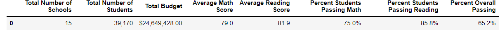
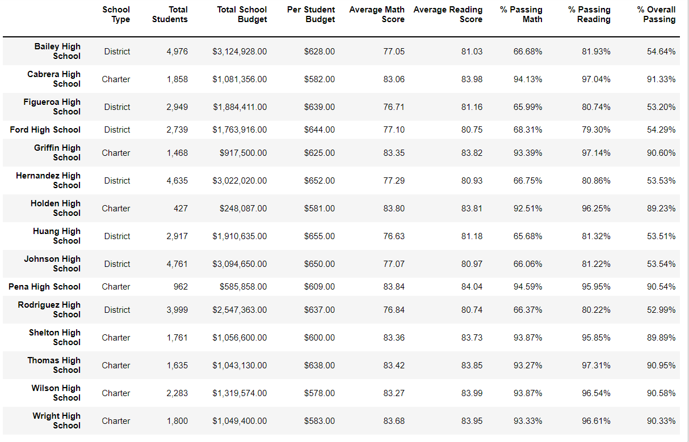
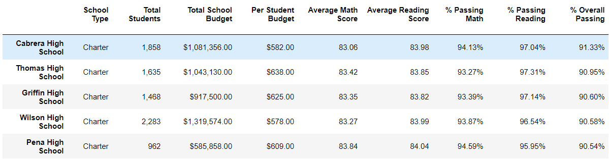
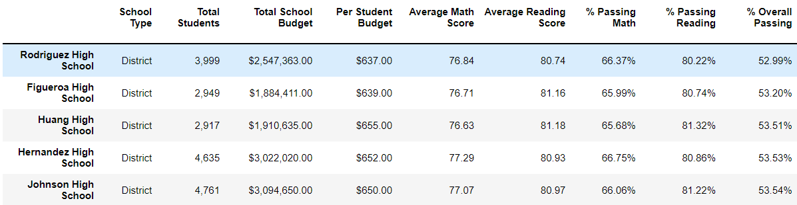
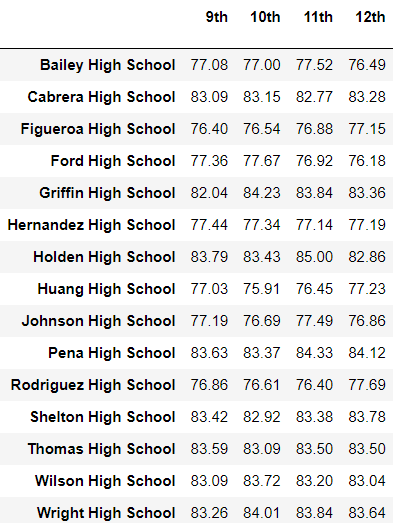
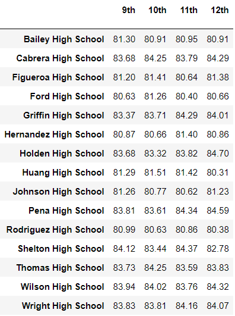
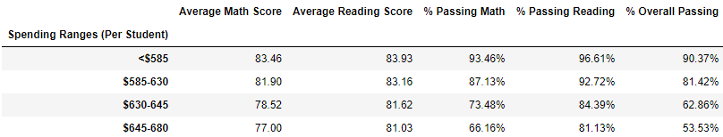
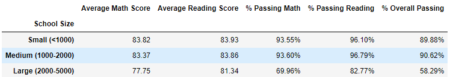
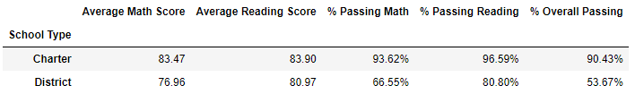

# pandas-challenge
## Module 4 Challenge
In this project I used Pandas and Jupyter Notebook to create multiple reports that analyze the schools within the district in order for them to make strategic decisions regarding future school budgets and priorities. 

## Observable Trends
Based off the data tables you can observe that charter schools have a higher overall passing percentage compared to district schools. Another trend is that larger sized schools have a lower overall passing percentage compared to small and medium sized schools.

## District Summary
In this dataframe we analyze:
- Total schools
- Total Students 
- Total budget
- Average math scores
- Average reading scores
- Percentage of students who passed math
- Percentage of students who passed reading
- Percentage of students who passed math and reading

## School Summary
In this dataframe we analyze key metrics regarding each individual school, including:
- School name
- School type
- Total school budget
- Per student budget
- Average math score
- Average reading score
- Percentage of students who passed math
- Percentage of students who passed reading
- Percentage of students who passed math and reading

## Highest-Performing Schools by Overall Percent
This dataframe displays the top-5 performing schools based on the percentage of students who passed math and reading. The following metrics are included in the results:
- School name
- School type
- Total students
- Total school budget
- Per student budget
- Average math score
- Average reading score
- Percentage of students who passed math
- Percentage of students who passed reading
- Percentage of students who passed math and reading

## Lowest-Performing Schools by Overall Percent
This dataframe displays the bottom-5 performing schools based on the percentage of students who passed math and reading. The following metrics are included in the results:
- School name
- School type
- Total students
- Total school budget
- Per student budget
- Average math score
- Average reading score
- Percentage of students who passed math
- Percentage of students who passed reading
- Percentage of students who passed math and reading

## Math Scores by Grade
In this dataframe is a list of the average math scores of each grade level (9th-12th) for each individual school. 

## Reading Scores by Grade
In this dataframe is a list of the average reading scores of each grade level (9th-12th) for each individual school. 

## Scores by School Spending
This table breaks down school performancess based on average spending ranges per student. Metrics for this table include:
- Spending ranges per student
- Average math score
- Average reading score
- Percentage of students who passed math
- Percentage of students who passed reading
- Percentage of students who passed math and reading

## Scores by School size
This table breaks down school performancess based on the size of the school (amount of students in each school). Metrics for this table include:
- The range of the schools size
- Average math score
- Average reading score
- Percentage of students who passed math
- Percentage of students who passed reading
- Percentage of students who passed math and reading

## Scores by School Type
This table breaks down school performancess based on the type of school it is (district or charter). Metrics for this table include:
- The type of school
- Average math score
- Average reading score
- Percentage of students who passed math
- Percentage of students who passed reading
- Percentage of students who passed math and reading

